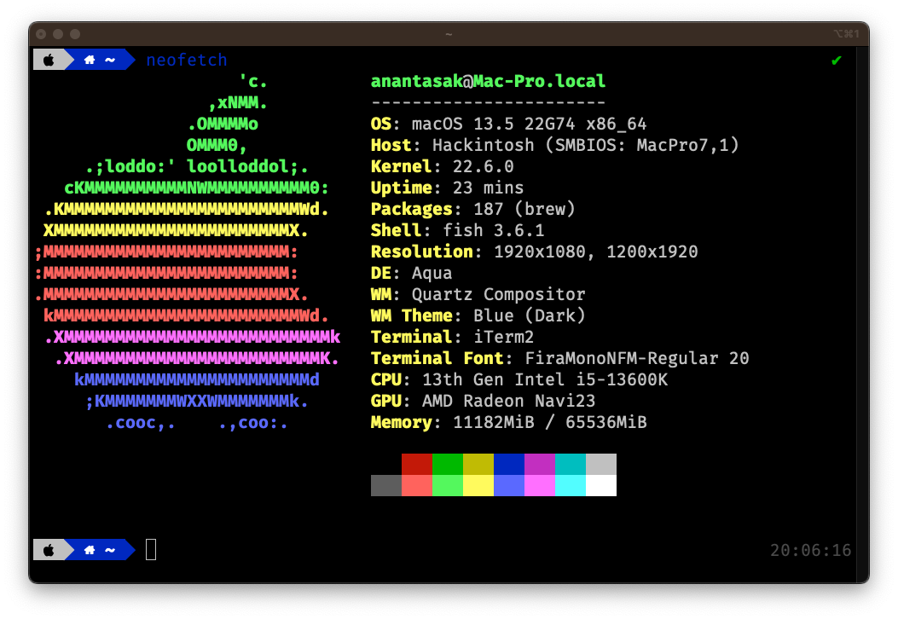

OC: 0.9.5

MB: NZXT N7 Z790

CPU: Core i5 13600K

RAM: OCPC 16GB X4 64GB 4800 run at 4533

VGA: Gigabyte RX6650XT Spoof ID

OS: Ventura 13.5

WIFI: GlinkStar BCM94360CD

---

## Know Issue

- Random panic
- Android Emulator Black Screen on x86_x64, on X86 Working fine
- Usb port not show in system but working normally

https://browser.geekbench.com/v5/cpu/21702819

## Base Efi From Asrock Z690SL

https://www.tonymacx86.com/threads/asrock-z690-steel-legend-13900kf-12900k-6600xt.317456/